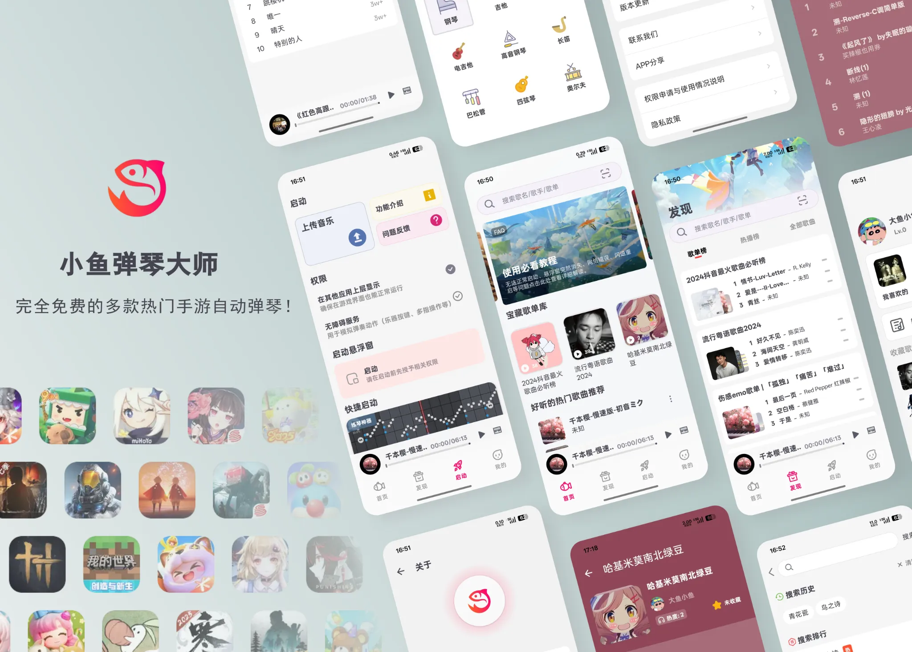

	
	<h1>小鱼弹琴大师</h1>

---

    
    
    
    
    
    
    
    
    

 🗡️ 小鱼弹琴大师 基于MVVM架构，并结合Jetpack（Room、ViewModel）、Coroutines、Glide 和 Material Design 的现代 Android 开发。 

> 示例图片

    

## 介绍
**小鱼弹琴大师**
> 完全免费的多款热门手游自动弹琴助手，让每个人都能轻松“弹”出好听的旋律。 
下载：https://www.fishceo.com/softwareDownload 
软件使用教程：https://pd.qq.com/s/flvrwv62h?b=2 
导入曲谱教程：https://pd.qq.com/s/f9kex43v6?b=2 
点击链接加入腾讯频道【小鱼弹琴大师】：https://pd.qq.com/s/7xtnhnvae?b=9 

---

- **0 门槛上手**：不会看谱、不会弹琴也能玩转热门音乐游戏。
- **全程自动弹奏**：一边玩游戏一边听“完美演奏”，解放双手，专注享受音乐。
- **免费无广告**：核心功能全部开放，不插广告、不强制充值。
- **为玩家而生，也为开发者而生**：既是玩家的自动弹琴神器，也是 Android 开发者学习 MVVM + Jetpack 的开源范例。
- 内置 **乐谱搜索页**，支持按关键字快速搜索游戏曲谱。
- 提供搜索联想与历史记录，常用曲目一键直达。
- 支持分页加载与推荐榜单，热门曲目优先展示。
---

## 技术栈和开源库
- **最低 SDK 级别**：21
- **基于 Kotlin**
### Jetpack 组件
- **Lifecycle**
- **ViewModel**
- **DataBinding**
- **Room**

### 架构
- **MVVM 架构**（View - DataBinding - ViewModel - Model）
- **Bindables**
- **Repository 模式**

### 网络与 API
- **Retrofit2 & OkHttp3**
- **Gson**
- **Glide**

### 测试相关
- **test-core**：`androidx.test:core`
- **test-rules**：`androidx.test:rules`
- **test-junit**：`androidx.test.ext:junit`
- **test-espresso-core**：`androidx.test.espresso:espresso-core`

## Android 的系统级文件分享（Share Sheet）集成
 - 功能允许用户从 QQ、微信、系统文件管理器或其他应用中分享或打开曲谱文件，直接导入到“小鱼弹琴大师”应用中进行导入。
 - VIEW、SEND：支持 QQ、微信、支持系统文件管理器导入单文件。
 
## API 安全与请求签名

> 接口签名认证机制 - 基于 HMAC 的对称密钥签名认证机制（HMAC-based Authentication）

- **基本思想**
  - 客户端与服务端共享密钥（secret）。
  - 客户端使用 `HMAC-SHA256` 对“规范串 canonical_string”计算签名。
  - 服务端用相同算法与密钥复算比对，一致则通过。
  - 与 OAuth 的 Signature、AWS Signature V4、微信/支付宝的签名机制本质相同。
  - 请求签名验证（防篡改、防重放）
    - 时间戳 + 随机数校验（防重放攻击）
    - 完整性校验（AppIntegrity）（防魔改客户端）
    - 版本追踪 / 灰度控制（版本字段）
    - 链路追踪（RequestId）（日志监控）
  
## 原生库与 ABI 支持

- 本项目的 JNI/NDK 原生库当前支持以下 ABI：
  - arm64-v8a
  - armeabi-v7a
  - x86
  - x86_64

## 架构
**小鱼弹琴大师** 基于 MVVM 架构和 Repository 模式，遵循 [Google 官方架构指南](https://developer.android.com/topic/architecture)。

